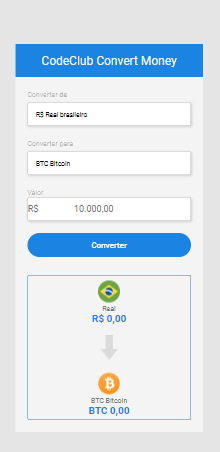

# currency convert

<!---Esses são exemplos. Veja https://shields.io para outras pessoas ou para personalizar este conjunto de escudos. Você pode querer incluir dependências, status do projeto e informações de licença aqui--->

> converso de moedas feito em javascript 
### Tecnologias Utilizadas No Projeto

Converso De Moedas Converte Real Para Bitcoin Dolar É Euro

- [x] HTML 
- [x] CSS
- [x] JAVASCRIPT

Converso Simples O Usuario Digita o Valor Em Real Ele Converte Para Dolar Euro ou Bitcoin
